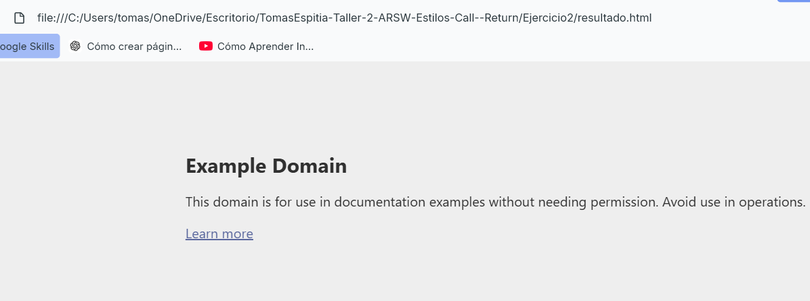
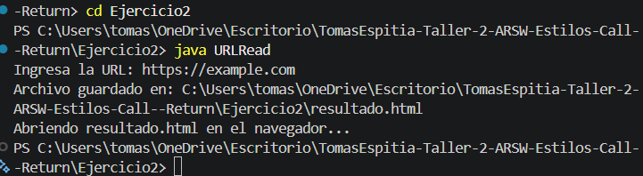

## Exercise 2 - Reading a URL and saving it as HTML

---

### Description

The goal of this program is to read a URL entered by the user, download the HTML content of that page, save it to a local file called `resultado.html`, and then automatically open it in the default web browser.

The user just needs to enter a valid URL when the program asks for it, and the program takes care of the rest.

---

### How it works

1. The program asks the user to type a URL.
2. It connects to that URL and reads the HTML content line by line.
3. It saves the content into a file called `resultado.html` in the same folder where the program is running.
4. It opens that file in the default web browser automatically.

---

### How to run

Compile and run the program:

```
javac URLRead.java
java URLRead
```

Then enter a URL when prompted, for example:

```
https://example.com
```

---

## Test output screenshot




---

### Conclusion

This exercise helped understand how Java can connect to a web address and read its content using the `URL` and `BufferedReader` classes. It also showed how to write that content to a local file and interact with the operating system to open a browser automatically.
