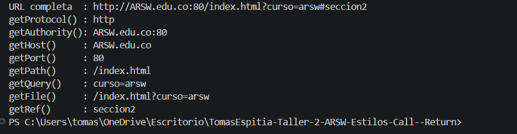

## Ejercicio 3.1 - Lectura de información de una URL en Java

---

### Descripción

objetivo del programa es crear un objeto de tipo URL en Java y mostrar en pantalla la información que se puede obtener a partir de los métodos principales de esta clase.

Para este ejercicio se utilizó la siguiente URL:

http://ARSW.edu.co:80/index.html?curso=arsw#seccion2

Esta dirección fue elegida porque contiene diferentes partes importantes de una URL, como el protocolo, el host, el puerto, la ruta del recurso, la consulta y la referencia.

---

### Explicación de cada metodo

1. ### getProtocol()

- Retorna el protocolo utilizado por la URL.
- En este caso retorna: http

2. ### getHost()

- Retorna únicamente el servidor o dominio de la URL.
- ldbn.escuelaing.edu.co

3. ### getPort()

- Retorna el número del puerto indicado en la URL
- 80

4. ### getPort()

- Retorna el número del puerto indicado en la URL.
- 80

5. ### getPath()

- Retorna la ruta del recurso solicitado dentro del servidor.
- /index.html

6. ### getQuery()

- Retorna los parámetros enviados en la URL después del símbolo ?.
- curso=arsw

7. ### getFile()

- Retorna la ruta del archivo junto con la consulta.
- /index.html?curso=arsw

8. ### getRef()

- Retorna la referencia o sección indicada después del símbolo #.

---

## Imagen de la salida

---

### Conclusión

Con este ejercicio se pudo comprender cómo Java permite trabajar con direcciones web mediante la clase URL.
El programa permite separar una dirección en sus diferentes componentes, lo cual es útil para entender cómo están formadas las URLs y cómo se pueden manipular desde una aplicación Java.