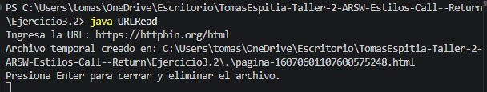

## Ejecución del programa

---

### Descripción 

Este ejercicio corresponde al punto 3.2 Leyendo páginas de internet del taller de ARSW.
El objetivo principal es crear una aplicación tipo navegador simple en Java, capaz de solicitar una dirección URL al usuario, leer el contenido HTML de esa página y guardarlo en un archivo para poder visualizarlo posteriormente desde el navegador.

En este caso, el programa solicita una URL por consola, descarga el contenido de la página y crea un archivo HTML temporal. Después de revisar el archivo, el usuario puede presionar Enter para cerrar el programa y eliminar el archivo generado, evitando que queden archivos innecesarios en la carpeta del proyecto.

--- 

### Como funciona

El programa funciona como un navegador básico.
Primero pide al usuario una URL, luego se conecta a esa dirección, lee el contenido HTML de la página y lo guarda en un archivo .html.

Para la prueba se utilizó la siguiente URL:

https://httpbin.org/html

Al ingresar esta dirección, Java abre un flujo de datos hacia la página web, descarga su contenido y lo guarda en un archivo temporal con extensión .html.

Después, el programa abre automáticamente ese archivo en el navegador usando la clase Desktop.
Esto permite comprobar visualmente que la página fue leída correctamente.

Una vez revisado el archivo, el usuario presiona Enter en la consola.
En ese momento el programa elimina el archivo temporal para que no quede almacenado en la carpeta del proyecto.

--- 

### Como se ejecuta

Para compilar el archivo se utiliza el siguiente comando:

javac URLRead.java

Para ejecutar el programa se utiliza:

java URLRead

Después de ejecutar el programa, se ingresa la URL solicitada:

https://httpbin.org/html

---

### Salida

---

### Conclusion

Con este ejercicio se logró implementar una aplicación sencilla en Java que funciona como un navegador básico.
El programa solicita una dirección URL, descarga el contenido HTML de esa página, crea un archivo temporal y lo abre en el navegador para verificar el resultado.

Además, se implementó la eliminación del archivo temporal después de presionar Enter, lo cual permite mantener limpia la carpeta del proyecto después de cada ejecución.

Este ejercicio permite comprender el uso de la clase URL, los flujos de entrada y salida, y la escritura de archivos en Java.