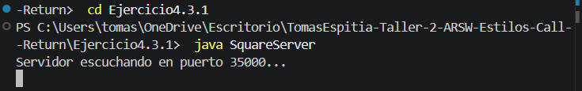
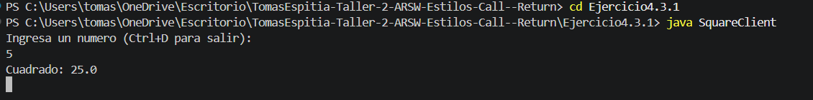

## Exercise 4.3.1 - Square Calculator using Sockets

---

### Description

The goal of this exercise is to build a basic client-server application using Java sockets. The server listens for a client connection and waits for numbers. For each number it receives, it calculates the square and sends the result back to the client.

---

### How it works

- **Server (SquareServer):** Listens on port `35000`. When a client connects and sends a number, it calculates the square of that number and returns it.
- **Client (SquareClient):** Connects to the server on port `35000`. The user types numbers from the terminal and the client displays the result received from the server.

---

### How to run

First, compile both files:

```
javac SquareServer.java SquareClient.java
```

Open two terminals. In the first one, start the server:

```
java SquareServer
```

In the second terminal, start the client:

```
java SquareClient
```

Type any number and press Enter to see its square.

---

## Test output screenshot




---

### Conclusion

This exercise showed how client-server communication works in Java using sockets. The server waits for a connection, receives data, processes it, and sends a response back. The client just sends input and displays what it gets from the server.
