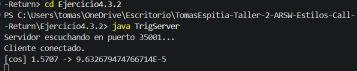
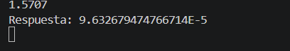

## Exercise 4.3.2 - Trigonometric Calculator using Sockets

---

### Description

This exercise extends the client-server socket model to support trigonometric functions. The server can calculate `sin`, `cos`, or `tan` for any number sent by the client. The client can also switch the active function at any time by sending a command like `fun:sin`.

---

### How it works

- **Server (TrigServer):** Listens on port `35001`. It keeps track of the current active function (default is `cos`). When it receives a number, it applies the current function and returns the result. When it receives a `fun:` command, it switches the function.
- **Client (TrigClient):** Connects to the server on port `35001`. The user can type a number to get the result, or type `fun:sin`, `fun:cos`, or `fun:tan` to change the function being used.

---

### How to run

Compile both files:

```
javac TrigServer.java TrigClient.java
```

Open two terminals. In the first one, start the server:

```
java TrigServer
```

In the second terminal, start the client:

```
java TrigClient
```

Examples of input in the client:

```
fun:sin
1.5707
fun:tan
0.7854
```

---

## Test output screenshot




---

### Conclusion

This exercise showed how to build a more flexible socket-based server that handles different types of requests. Separating commands from data inputs allows the client to control the server behavior dynamically without restarting the connection.
