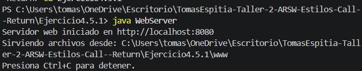
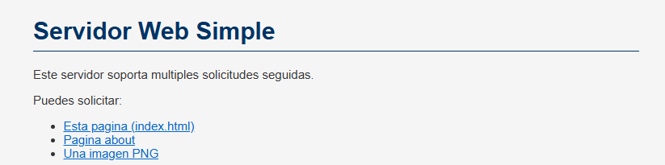

## Exercise 4.5.1 - Basic HTTP Web Server

---

### Description

The goal of this exercise is to build a simple HTTP web server from scratch using Java sockets. The server listens on port `8080` and serves static files (HTML, CSS, JS, images) from a folder called `www`. It handles basic HTTP GET requests and returns the appropriate content type for each file.

---

### How it works

- The server starts and listens on port `8080`.
- When a browser makes a GET request, the server reads the requested file from the `www` folder.
- If the file exists, it responds with `200 OK` and sends the file content.
- If the file does not exist, it responds with `404 Not Found`.
- If a request is made to `/`, it automatically serves `index.html`.

Supported file types: `html`, `css`, `js`, `png`, `jpg`, `gif`, `ico`, `txt`.

---

### How to run

First, compile the file:

```
javac WebServer.java
```

Create a folder called `www` in the same directory and place an `index.html` file inside it.

Then run the server:

```
java WebServer
```

Open a browser and go to:

```
http://localhost:8080
```

---

## Test output screenshot




---

### Conclusion

This exercise helped understand how HTTP works at a low level. Building the server manually showed what happens behind the scenes when a browser requests a page: the server reads the request, finds the file, and sends it back with the correct headers.
