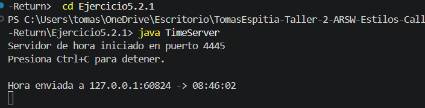
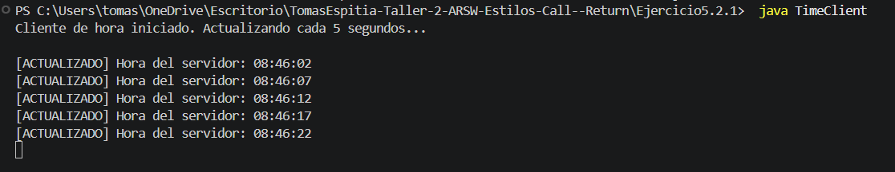

## Exercise 5.2.1 - Time Server using UDP

---

### Description

This exercise implements a client-server application using UDP (User Datagram Protocol). The client sends a request to the server every 5 seconds asking for the current time, and the server responds with the time in `HH:mm:ss` format. If the server does not respond within 2 seconds, the client shows the last known time instead.

---

### How it works

- **Server (TimeServer):** Listens on UDP port `4445`. Every time it receives a packet from a client, it replies with the current server time.
- **Client (TimeClient):** Sends a time request to the server every 5 seconds. If a response arrives within the timeout, it prints the updated time. If not, it shows a message with the last known time.

---

### How to run

Compile both files:

```
javac TimeServer.java TimeClient.java
```

Open two terminals. In the first one, start the server:

```
java TimeServer
```

In the second terminal, start the client:

```
java TimeClient
```

The client will print the server time every 5 seconds automatically.

---

## Test output screenshot




---

### Conclusion

This exercise showed how UDP differs from TCP. UDP does not guarantee delivery, so the client needs to handle the case where the server does not respond. This is useful in scenarios where speed matters more than reliability, like time synchronization or real-time data.
