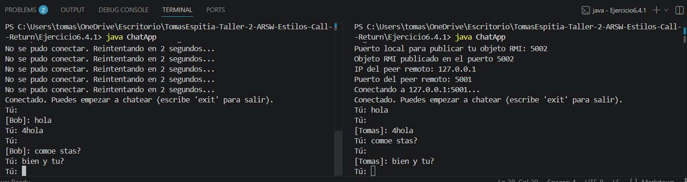

## Exercise 6.4.1 - Peer-to-Peer Chat using RMI

---

### Description

This exercise implements a peer-to-peer chat application using Java RMI (Remote Method Invocation). Each instance of the application acts as both a server and a client at the same time. Before starting, the user enters a local port to publish their own RMI object, and then enters the IP address and port of the other peer to connect to.

---

### How it works

- Each application publishes a `ChatImpl` object on its own RMI registry using the port the user provides.
- Then it looks up the remote peer's `ChatService` on the given IP and port.
- If the remote peer is not ready yet, it keeps retrying every 2 seconds until it connects.
- Once connected, both users can send messages to each other by typing in the terminal.
- To exit, type `exit`.

---

### How to run

Compile all files:

```
javac ChatInterface.java ChatImpl.java ChatApp.java
```

Open two terminals (or two machines on the same network).

**Terminal A:**

```
java ChatApp
```

Enter when prompted:
- Your name: `Tomas`
- Local port: `5001`
- Remote IP: `127.0.0.1`
- Remote port: `5002`

**Terminal B:**

```
java ChatApp
```

Enter when prompted:
- Your name: `Bob`
- Local port: `5002`
- Remote IP: `127.0.0.1`
- Remote port: `5001`

---

## Test output screenshot



---

### Conclusion

This exercise showed how Java RMI allows applications to call methods on objects running in another JVM, even on a different machine. Building a chat with RMI demonstrated how peer-to-peer communication works when both sides need to receive and send data at the same time.
